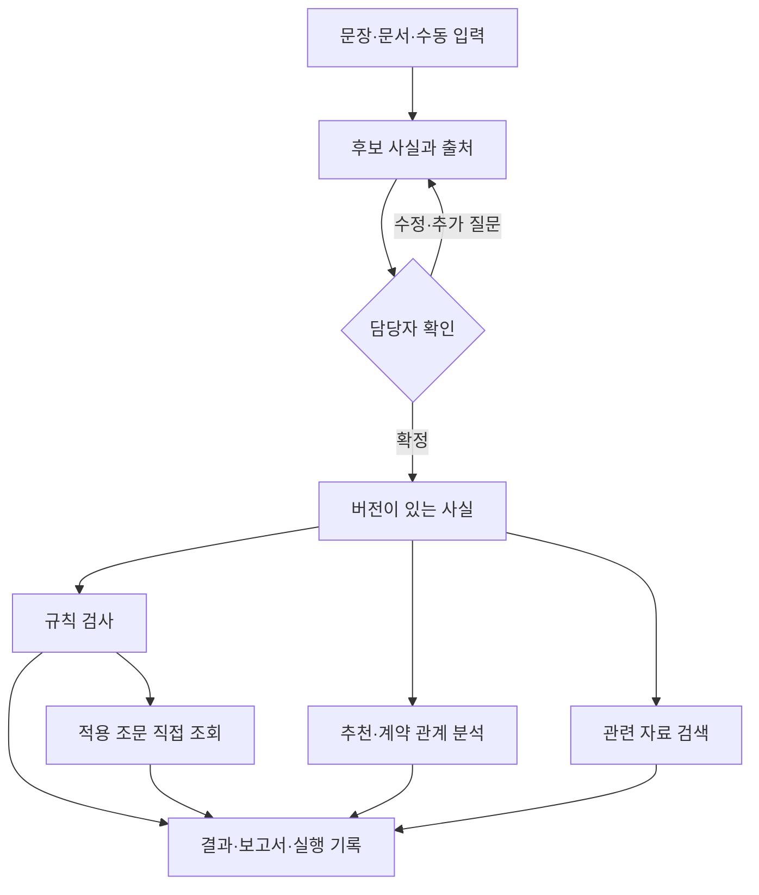

# 단계 1: 목표 업무·운용 환경·아키텍처

상태: 구현 방향을 정하는 설계. 아래 모듈명·입출력은 논리적 경계이며 상세 스키마는 단계 3에서 확정한다.
모델·저장 엔진은 단계 2의 작은 실험 결과에 따라 결정한다.

## 대상 업무와 범위

계약요청부서·계약담당자가 계약방법 확정 및 결재 상신 전에 자료를 확인하고 보완하는 업무를 지원한다.
최종 사실 확인과 계약 판단은 담당자가 수행한다. 공개 계약의 기재 조항 예측은 적법성 판단의 정답이 아니다.

- 우선 업무: 소액수의, 경쟁 불성립, 긴급·보안의 입력·증빙·조건 확인.
- 추가 유형: 개별 조건을 검증한 범위만 지원; 그 외는 안내 전용.
- 문서 업무: 텍스트 PDF부터 시작하고 스캔 OCR과 HWP 직접 처리는 가용성 실험 후 결정.
- 기존 체계 연계: 최초에는 수동 입력·파일 반입. 실제 체계 API 접근을 전제하지 않는다.
- 실제 군 데이터·사용자·장비 확보 여부는 미확정이다. 공개/가상자료 시험과 군 실증을 구분한다.

## 운용 형태

| 형태 | 구성 | 결정/검증 |
|---|---|---|
| 기본형 | 단일 PC, Python 기반 규칙·경량 추천·로컬 검색, 수동 사실 확인 | 운영 라이브러리 최소화 유지, 실제 대상 OS·CPU·RAM·설치 권한 조사 |
| 확장형 | 기본형 + 문서 처리 및 선택적 로컬/승인 내부 모델 서비스 | OCR·LLM·임베딩의 추가 용량·메모리·속도·라이선스를 실험 |
| 공유형 | 승인된 내부 서버·여러 사용자 | 후속 범위. 계정·부서별 자료 격리·동시성 필요; 대회 구현의 선행조건 아님 |

모듈은 우선 하나의 애플리케이션 안에 둔다. 모델 의존성 때문에 필요할 때만 별도 프로세스로 분리한다.
인터넷 없는 실행과 군 반입 승인 완료는 별개다. 공개망 자료 수집 결과는 검토한 패키지로 반입한다.

## 모듈 경계와 의존 방향

| 경계 | 입력 → 출력 | 책임 |
|---|---|---|
| Intake | 입력 문장/문서 → 후보 값·원문 위치·상태 | 추출만 수행; 확인 완료 상태 생성 금지 |
| Confirmation | 후보·수정·담당자 행위 → 확정 사실 버전 | 변경 시 이전 확인/결과 유효성 재검사 |
| RuleEngine | 확정 사실 + 규칙팩 버전 → 항목별 조건 결과 | 유형별 적용 가능성·예외·정보 부족 처리 |
| LegalSourceStore | 조문 ID + 적용 시점/버전 → 정확한 원문 | 검색 순위에 의존하지 않는 근거 제공 |
| ReferenceSearch | 질의 + 자료·시점 필터 → 출처가 있는 관련 자료 | 추천 참고자료 검색; 법적 적용 확정 금지 |
| ContractRepository | 검증된 이력 → 날짜·부서·사업 등 조건의 후보군 | 고유번호·변경 차수·취소·반입 이력 관리 |
| ContractAnalysis | 확정 사실 + 이력 후보군 + 정책 → 분석 근거·신호 | 합산 대상·제외 사유·비교 가능성 기록 |
| Advisor | 확정 사실 + 모델 + 검증된 유사도 정보 → 추천/기권 | 기권과 경고 정책 일치, 모델별 분모 보존 |
| ReviewService | 위 구성요소 → 불변 검토 결과와 상태 | 순서·시간 제한·기능별 실패·재검토 관리 |
| Presenter | 검토 결과 → UI/정형 보고서/선택적 설명 | 화면에 없는 판정을 생성하지 않음 |

RuleEngine은 UI, OCR, LLM 클라이언트, 검색 엔진을 import하지 않는다.
화면·CLI는 동일 ReviewService를 사용한다. 모델 API 응답은 경계에서 검증한다.
모든 구성요소를 별도 서버나 범용 플러그인 프레임워크로 만들지는 않는다.

## 먼저 결정하는 데이터 원칙

1. 계약 사실: 고유번호·차수·부서·사업·시점·대상·금액을 명시한다.
2. 금액: 추정가격·계약총액·단가·수량 및 세금 여부를 분리하고 원문 값·변환 근거를 보존한다.
3. 후보와 확정 사실을 분리한다. 누락/충돌을 임의 기본값으로 확정하지 않는다.
4. 증빙 파일 존재, 내용 부합, 유효기간, 담당자 확인은 서로 다른 속성이다.
5. 원문·조문 관계·문서 위치가 기준 데이터이며 색인/벡터는 재생성 가능한 파생물이다.
6. 규칙·모델·색인·확정 사실 버전의 조합을 실행마다 고정한다.
7. 공개 원본·허가된 내부 이력·가상 사례를 구분한다. 실제 자료를 공개 GitHub에 저장하지 않는다.
8. 과거의 전체 보고서가 필요하면 당시 실행 기록을 반환한다. 재실행 시 생성 시각 등과 결정론적 결과 필드를 구분한다.

상세 enum, JSON Schema, Python 구현형 및 저장소 선택은 단계 3에서 정의한다.

## 검색 구조 결정

- n-gram TF-IDF도 벡터 표현이다. 표현 방식, 후보 검색 방식, 재정렬 방식을 각각 평가한다.
- 규칙에 연결된 조문은 직접 조회한다. 관련 사례 검색과 혼합하지 않는다.
- 법령은 조·항·호·목 관계와 단서/예외 문맥을 유지하고 시행 버전을 구분한다.
- 유사계약 참고는 조건 필터 후 순위 검색을 사용한다.
- 분할 후보는 전체 유효 후보군 확보 후 비교한다. 화면 top-k를 합산 대상 제한으로 사용하지 않는다.
- 모델 변경으로 유사도 분포가 바뀌면 기권·합산 임계값도 다시 검증한다. 기존 0.30/0.45/0.70을 그대로 이식하지 않는다.
- IDF·정규화·임베딩·색인 갱신은 버전 변경이다. 기존 실행 중인 색인을 부분 교체하지 않는다.
- 법령/문서 검색은 조문번호·제품번호·부정 표현을 보존한다. 계약명 분류용 정규화를 공유하지 않는다.
- ANN 및 벡터 DB 채택은 실제 후보량·속도·누락률 시험 후 결정한다.
- 근거 식별자·원문 위치·시점·검색 방식·점수 종류를 반환한다. 서로 다른 검색기의 점수를 같은 확률로 해석하지 않는다.
- 현재 n-gram은 비교 기준으로 보존한다. 의미 검색 도입 여부는 단계 2에서 결정한다.

## 권한과 장애 정책

불변식: 동일한 확정 사실·규칙 버전에서 추천/검색/LLM 설명 사용 여부가 규칙 조건 결과를 바꾸지 않는다.
AI의 후보 수정은 새 담당자 확인과 새 사실 버전을 요구한다. 입력·증빙이 바뀌면 종전 결과를 최신으로 표시하지 않는다.

| 상황 | 처리 |
|---|---|
| 중요 사실 미확인·충돌 | 해당 검사 보류, 필요한 확인 질문 표시 |
| LLM/OCR 시간 초과·오류 | 자동 추출 불가를 표시하고 원문을 보며 수동 입력 |
| 추천/참고 검색 실패 | 해당 기능만 unavailable; 핵심 규칙 검사와 구분 |
| 필수 근거 원문·적용 버전 확인 불가 | 근거가 검증된 최종 결과로 발행하지 않음; 수기 확인 경로 제공 |
| 규칙 파일 손상·적용 기간 불명 | 규칙 판정 중단, 수기 체크리스트 안내 |
| 계약 이력 누락·일부 반입 | 분석 불가/부분 결과; 위험 없음으로 표시 금지 |
| 저장 실패 | 완료 상태 확정 금지, 재시도 시 중복 기록 방지 |
| 모델 요약이 정형 결과와 충돌 | 정형 설명으로 대체; 판정 문구를 모델에 맡기지 않음 |

승인된 모델 연결 대상, 외부 통신 차단, 입력 크기·시간 제한, 문서 내 지시문을 데이터로 취급하는 경계,
원문/중간파일/로그 접근·삭제·백업을 설계한다. 상세 보관기간과 군 운용 절차는 적용 부서와 확인한다.

## 유지·분리·실험할 것

| 구분 | 내용 |
|---|---|
| 유지 | 결정론적 규칙, 경량 기본형, 기존 CLI·웹의 사용 흐름, 기존 모델·검색 기준선 |
| 분리 | 후보/확정 사실, 조문 직접 조회/참고 검색, 상위 추천/합산 후보, 원본/색인, 실행/UI |
| 수정 | 타입 불일치, LLM 보강 경계, 증빙 상태, 이력 형식·식별, 기권과 경고 일관성 |
| 비교실험 | 문서 파서·OCR·소형 모델·의미 검색·재정렬·실행 환경 |
| 보류 | 상세 스키마 확정, 전면 모델 교체, 별도 벡터 DB, 다중 서버, 내부 데이터 자동 재학습 |

## 이 단계의 승인 기준

업무 범위·모듈 책임·검색의 역할·사실 확인 경계·장애 정책을 문서로 확인할 수 있다.
구현 완료나 군 배포 승인으로 간주하지 않는다. 다음 단계의 실험 결과로 바뀐 결정은 이유와 영향 범위를 기록한다.
