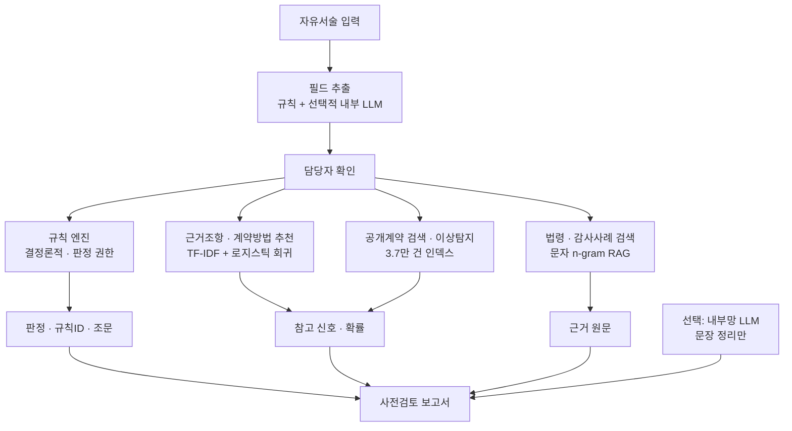

# MIL-Check: 공개 계약데이터 학습 기반 군 계약 사전점검 AI 에이전트

> 2026 제3차 국방 AI 활용 아이디어 경연대회 제출 초안 (v2)
> 주제: AI를 활용한 국방 자원관리 및 행정 효율화
> 작성 기준일 2026-07-25 · 규정 기준일 2026-07-23
> 모든 성능 수치는 `python -m milcheck.cli evaluate`로 재현 가능

---

## 0. 한눈에 보는 제안

### 제안명

**MIL-Check — 공개 계약데이터를 학습한 폐쇄망 계약 사전점검 AI 에이전트**

### 한 문장 정의

방위사업청 공개 계약데이터 3.7만 건을 학습한 AI가, 계약 담당자가 결재를 올리기
전에 **적용할 근거조항과 계약방법을 확률로 추천**하고, **유사계약 가격대·분할발주·
업체편중을 탐지**하며, **현행 법령 원문을 근거로 연결**해 주는 오프라인 의사결정
지원 체계다.

### 이 제안의 AI 구성

| 계층 | 기법 | 성능 (외부 라벨 기준) |
|---|---|---|
| 입력 이해 | 자유서술 → 구조화 필드 추출 | 홀드아웃 필드 정확도 **87.9%** |
| 근거조항 추천 | 문자 n-gram TF-IDF + 다항 로지스틱 회귀 (19클래스) | Top-1 **78.1%** / Top-3 **95.4%** |
| 계약방법 추천 | 동일 구조 (6클래스) | Top-1 **81.0%** / Top-2 **96.0%** |
| 근거 검색 | 문자 n-gram 벡터 검색 (RAG) | Recall@1 **96.7%** / MRR **0.967** |
| 이상 탐지 | 유사도 군집 + MAD 로버스트 z, 시간창 합산 | 분할발주 5.53%, 가격이상 1.70% 표시 |
| 법령 검사 | 결정론적 규칙 엔진 | 감사사례 재현 **91.7%** |
| 문서화 | 선택적 내부망 LLM | 판정·근거 변경 불가 |

### 핵심 차별점 — 학습은 공개망, 추론은 폐쇄망

군 내부망에서 AI를 못 쓰는 것이 아니라, **쓸 수 있는 형태로 만들어 반입한다.**

공개망에서 scikit-learn으로 학습한 모델을 희소 가중치 JSON(압축 1.2MB)으로
내보내고, 운영 환경에서는 **파이썬 표준 라이브러리만으로 추론**한다. 학습 환경과
폐쇄망 추론기의 성능 차이는 Top-1 기준 **0.18%p**로 측정되었다. GPU도, 외부
패키지도, 인터넷도 필요 없다.

### 권한 분리 — 생성형 AI가 법적 판정을 하지 않는다

- **판정**은 규칙 엔진만이 내린다. 동일 입력에 동일 판정, 모든 판정에 규칙 ID와 조문이 남는다.
- **추천·탐지**는 확률과 신호만 제시하며 판정을 바꾸지 못한다.
- **LLM**은 확정된 결과를 문장으로 다듬을 뿐이다.

이 불변식은 평가세트 60건 전체에 대해 "AI 계층 탑재 전후의 판정·근거·누락증빙이
완전히 동일한가"를 자동 검증하는 회귀 테스트로 강제된다.

---

## 1. 문제 인식

### 1.1 현행 업무의 어려움

계약 담당자는 한 건을 검토하며 다음에 답해야 한다.

- 적용할 수의계약 조항은 무엇이며 추정가격이 그 상한을 충족하는가
- 계약상대자가 소기업·여성기업 등 법정 자격을 실제로 갖추었는가
- 1인 견적이 가능한가, 2인 이상 전자견적이 필요한가
- 호환성·특허·유일공급 주장이 객관적 시장조사로 뒷받침되는가
- 긴급성이 예측 곤란한 사건에서 왔는가, 내부 행정지연에서 왔는가
- 동일 사업을 금액 한도에 맞추려 분할한 것은 아닌가

이 판단에는 국가계약법·시행령·시행규칙·계약예규·국방부 훈령과 공개 감사사례가
함께 필요하지만, 원문은 여러 문서에 흩어져 있고 과거 사례의 금액기준은 현행과 다르다.

### 1.2 공개 데이터로 확인한 실태

방위사업청 공개 계약데이터 37,595건(2024-11 ~ 2025-12, 군 계약 97.8%)을
분석한 결과다.

| 확인 항목 | 결과 |
|---|---:|
| 수의계약 비중 | 71.5% |
| 근거조항이 명시된 계약 | 30,059건 |
| 근거조항의 금액 상한과 계약금액이 어긋난 후보 | 191건 (0.88%) |
| 유사 발주 합산 시 소액수의 상한을 넘는 후보 | 934건 (5.53%) |

문제가 추상적이지 않다는 점, 그리고 **기계적으로 검사 가능한 형태로 존재한다는
점**이 공개 데이터로 확인된다.

### 1.3 범용 생성형 AI만으로는 부족한 이유

- 과거 규정을 현행처럼 인용할 수 있다
- 필수 증빙이 빠져도 자연스러운 답변을 만든다
- 유사한 과거 계약이 있었다는 사실을 적법성 근거로 오인한다
- 군 계약정보를 외부 API로 전송하면 보안 위험이 발생한다
- 동일 입력에 결과가 흔들려 감사 추적이 어렵다

필요한 것은 챗봇이 아니라, **법령은 결정론적 규칙으로 고정하고 판단이 아닌
영역에서만 AI를 쓰는 구조**다.

---

## 2. 아이디어의 핵심

### 2.1 사용자와 사용 시점

초기 사용자는 군 계약요청부서와 계약담당자이며, 사용 시점은 계약방식 확정 및
결재 상신 직전이다.

담당자는 JSON이 아니라 문장으로 입력한다.

> "기존 정수장비에 들어가는 부품인데 다른 회사 제품은 호환이 안 됩니다.
> 부가세 제외 4,600만원이고 가격조사와 자격 확인은 마쳤습니다.
> 업체 확인서는 받았지만 시장조사는 아직 못 했습니다."

추출 계층이 이 문장에서 추정가격·계약유형·세부근거·증빙 목록을 뽑아 담당자
확인을 거친 뒤 검사에 넘긴다.

### 2.2 초기 적용 범위

국가계약법이 적용되는 군 물품·용역 계약 중 세 유형을 우선 다룬다.

1. 소액수의계약 (시행령 제26조제1항제5호가목)
2. 경쟁 불성립형 수의계약 (같은 항 제2호)
3. 긴급·보안형 수의계약 (같은 항 제1호)

재공고 유찰, 방산물자 특례, 공사·임대차는 별도 규칙팩으로 확장한다.
다만 **추천 모형은 19개 조항 전체를 학습**했으므로 범위 밖 조항이 더 적합해
보이면 그 사실을 안내한다.

### 2.3 출력

"승인/불승인"이 아니라 네 단계 사전점검 상태로 표시한다.

| 상태 | 의미 |
|---|---|
| 근거 성립 가능 | 핵심 조건 충족, 가격·자격·결재 통제 필요 |
| 보완 필요 | 사유 성립 여지는 있으나 필수 증빙 또는 절차 누락 |
| 제안 사유 부적합 | 금액 초과, 대체품 존재, 인위적 분할, 자체 지연 |
| 범위 밖 | 초기 규칙팩 대상이 아니어서 전문 검토 필요 |

여기에 **판정에 반영되지 않는 참고 신호**가 별도 구획으로 붙는다. 근거조항
추천 순위, 유사계약 가격대, 분할·편중 신호가 여기 들어간다. 구획을 분리한 이유는
담당자가 "AI가 판정했다"고 오인하지 않도록 하기 위해서다.

---

## 3. 시스템 설계



### 3.1 AI 모델 구조 — 근거조항·계약방법 추천

**입력 표현.** 계약명을 정규화(연도·차수 제거, 숫자 일반화)한 뒤 세 종류의 특징을
결합한다.

- 문자 단위 n-gram TF-IDF (2~4-gram, `char_wb`, 최대 12만 차원)
- 어절 단위 n-gram TF-IDF (1~2-gram, 최대 6만 차원)
- 업무구분(물품/용역)과 금액 구간(8구간)을 특수 토큰으로 삽입

문자 n-gram을 주 특징으로 쓰는 이유는 계약명이 "25-2차 일반비품(접수대) 구매"처럼
띄어쓰기와 표기가 불규칙하고, 형태소 분석기를 폐쇄망에 반입하지 않고도 부분
문자열을 포착할 수 있기 때문이다.

**분류기.** 다항 로지스틱 회귀(C=4.0, class_weight='balanced')를 사용한다.
심층 모델을 쓰지 않은 이유는 세 가지다.

1. **설명가능성** — 어떤 문자열이 어느 조항 쪽으로 점수를 밀었는지 가중치로 추적된다
2. **폐쇄망 이식성** — 가중치를 JSON으로 내보내 표준 라이브러리로 추론할 수 있다
3. **결정론성** — 동일 입력에 동일 확률이 나와 감사 추적이 가능하다

**출력 사용 방식.** 상위 확률이 55% 이상이고 1·2순위 격차가 20%p 이상일 때만
경고를 낸다. 담당자가 제시한 근거가 3순위 안에 있으면 "대안 안내", 밖에 있으면
"근거 재검토 요청"으로 강도를 나눈다. 임계값을 둔 이유는 **경고 과다가 이런
시스템의 주된 실패 원인**이기 때문이다.

**성능** (학습에 쓰이지 않은 홀드아웃 6,012건):

| 모델 | 클래스 | Top-1 | Top-2 | Top-3 | 다수결 기준선 |
|---|---:|---:|---:|---:|---:|
| 근거조항 | 19 | **78.1%** | **92.0%** | **95.4%** | 62.4% |
| 계약방법 | 6 | **81.0%** | **96.0%** | 98.9% | 70.2% |

### 3.2 폐쇄망 추론 이식

학습된 가중치 중 절댓값 상위 25%만 남기고 어휘·IDF와 함께 JSON으로 내보낸다.
운영 환경의 추론기는 scikit-learn의 `char_wb` 토큰화와 sublinear TF, L2 정규화를
표준 라이브러리로 재구현한다.

| 구현 | Top-1 | Top-2 | Top-3 |
|---|---:|---:|---:|
| scikit-learn (학습 환경) | 78.06% | 92.00% | 95.44% |
| 표준 라이브러리 (폐쇄망) | 77.88% | 91.78% | 95.41% |

**차이 −0.18%p.** 이것이 "폐쇄망이라 AI를 못 쓴다"는 통념에 대한 이 제안의 답이다.

### 3.3 근거 검색 (RAG)

법령·계약예규·공개 감사사례를 로컬 색인으로 만들고, 실무자의 구어체 질의에서
관련 조문을 찾는다. 세 가지 검색 방식을 구현하고 30건의 구어체 질의로 비교했다.

| 방식 | Recall@1 | Recall@3 | MRR |
|---|---:|---:|---:|
| BM25 (어절) | 0.533 | 0.633 | 0.572 |
| **문자 n-gram (채택)** | **0.967** | **0.967** | **0.967** |
| RRF 하이브리드 | 0.700 | 0.867 | 0.772 |

**하이브리드가 더 나을 것이라는 가설은 기각되었다.** 한국어 어미 변화 때문에
어절 BM25의 어휘 일치가 자주 실패하고("호환성이 없는" vs "호환이 안 되는"),
RRF는 약한 검색기의 순위를 그대로 반영해 성능을 끌어내렸다. 측정 없이 하이브리드를
채택했다면 성능을 27%p 손해 볼 뻔했다. 세 방식 모두 코드에 남겨 재현할 수 있게 했다.

승인된 온프레미스 임베딩 모델이 있으면 세 번째 검색기로 추가 가능하도록 인터페이스를
열어 두었으나, 기본안에서는 반입 대상 축소와 결정론성을 우선했다.

### 3.4 공개계약 검색·이상 탐지

3.7만 건을 압축 인덱스(1.2MB)로 반입한다. 개인·업체 식별정보는 반입하지 않고
부서명은 SHA-256 별칭으로 치환한다.

| 기능 | 방법 | 전수 적용 결과 |
|---|---|---:|
| 유사계약 검색 | 문자 n-gram 역색인 코사인 (질의당 14ms) | — |
| 가격대 참조 | 유사도 0.45 이상 표본의 사분위 | 적용률 58.2% |
| 분할발주 탐지 | 동일 부서·유사도 0.70·60일 창 합산이 상한 초과 | 5.53% 표시 |
| 가격 이상 | 품목군 log 스케일 MAD 로버스트 z (>3.5) | 1.70% 표시 |
| 업체 편중 | 부서별 수의계약 금액 점유율 60% 이상 | 부서의 1.00% |

**표시율이 낮다는 점이 중요하다.** 담당자가 무시하지 않을 수준의 경고량이라는
뜻이기 때문이다.

### 3.5 규칙 엔진

법령과 계약예규를 `조건–필요 증빙–실패 신호–후속 통제` 구조로 기계판독화한다.
금액 상한, 계약상대자 유형별 1인 견적 가능 범위, 전자견적 의무, 대체품 존재,
자체 유발 긴급성을 검사하며 각 결과에 규칙 ID와 조문을 남긴다.

### 3.6 LLM의 제한된 역할

내부망에 승인된 모델이 있을 때만 두 가지를 맡긴다.

1. 규칙 추출기가 채우지 못한 필드 보강 (규칙이 확정한 값은 덮어쓰지 못함)
2. 확정된 검사 결과를 결재보고서 문장으로 정리

**LLM이 실제로 값을 더하는 지점을 측정으로 특정했다.** 필드추출 홀드아웃 실패
3건은 모두 표현 다양성 문제였다 — "천사백만원"(한글 수사), "제조한 업체가 와서
직접 조립"(우회 표현), "만드는 데가 한 곳뿐"(우회 표현). 법적 판단 오류가 아니라
문장 이해 문제이므로, 정확히 이 구간에만 LLM을 붙인다.

---

## 4. 인트라넷·보안 적용 방안

### 4.1 기본 배포안

MVP와 실제 도입 기본안은 외부 통신이 필요 없는 구조다. 규칙 엔진, 추천 모형,
공개계약 인덱스, 근거 검색이 모두 표준 라이브러리로 동작한다.

### 4.2 세 가지 구성

| 구성 | 외부 인터넷 | LLM | 적용 판단 |
|---|---|---|---|
| 규칙 + ML 추천 + 로컬 RAG | 불필요 | 없음 | **MVP 기본안**, 보안심사·설명가능성에 유리 |
| 위 구성 + 내부 LLM | 불필요 | 온프레미스 | 승인된 서버가 있을 때 입력 이해·문서화 보강 |
| 외부 상용 API | 필요 | 클라우드 | 실제 군 내부정보 처리 기본안에서 **제외** |

계약명, 수량, 납기, 부대 위치, 고장·재고 상태는 결합될 때 민감한 운영정보가 될 수
있어, 외부 API는 보안담당기관의 명시적 승인 전에는 허용되지 않는 것으로 가정한다.

### 4.3 반입 대상과 절차

반입 대상은 세 종류이며 합계 3.5MB다.

| 대상 | 크기 | 갱신 주기 |
|---|---:|---|
| 법령·예규·감사사례 색인 | 12KB | 법령 개정 시 |
| 추천 모형 가중치 (2종) | 2.2MB | 반기 (신규 계약 누적 시 재학습) |
| 공개계약 인덱스 | 1.2MB | 반기 |

절차: ① 공식 원문·메타데이터 수집 → ② 악성코드 검사와 현행성 검토 →
③ 승인된 망연계 반입 → ④ 색인·규칙·모형 버전 갱신 → ⑤ 평가세트 회귀시험 및
변경 영향분석 → ⑥ 계약담당부서 확인 후 배포.

**모형 재학습은 공개 데이터로만 수행하므로 군 내부 데이터가 학습에 사용되지 않는다.**
이것이 폐쇄망 반입 심사를 단순하게 만드는 설계 선택이다.

---

## 5. 검증 설계와 결과

### 5.1 평가세트를 3층으로 분리한 이유

자체 제작 사례로만 평가하면 "내가 만든 규칙이 내가 만든 정답을 맞혔다"는
순환논증이 된다. 그래서 라벨 출처를 기준으로 세 층을 분리하고, **자체 라벨
성능으로 정확도를 주장하지 않는다.**

| 층 | 라벨 출처 | 건수 | 지표 |
|---|---|---:|---|
| L1 규칙 회귀 | 자체 작성 | 60 | 일치 60/60, **잘못된 통과 0건** |
| L2 실데이터 | 계약서의 실제 근거조항 | 300 | Top-1 78.0% / Top-3 95.7% |
| L3 감사사례 재현 | 공개 감사보고서 지적사항 | 12 | 탐지 **11/12 (91.7%)** |
| R 근거검색 | 실무 구어체 질의 | 30 | Recall@1 **96.7%** |
| E 필드추출 | 실무 문장 (홀드아웃) | 20 | 필드 정확도 **87.9%** |

L1은 **회귀 무결성 지표**일 뿐 실제 정확도가 아님을 문서와 코드 주석 양쪽에
명시했다. 금액 상한 전후(19,990,000 / 20,000,000 / 20,000,001원)를 촘촘히 포함한다.

### 5.2 알려진 한계를 세트 안에 기록했다

L3 미탐 1건과 한계 2건을 사례 파일에 그대로 남겼다.

| 사례 | 한계 |
|---|---|
| AUD-008 | "법인 성격"을 입력 필드로 받지 않아 열거주의 위반을 직접 지적하지 못함 |
| AUD-011 | 분할의 객관적 불가피성(감사원 면책 논리)을 규칙이 반영하지 못함 |
| AUD-012 | 시행규칙 제33조 전자견적 예외를 반영하지 못함 |

성능을 높이려 이 사례들을 세트에서 빼지 않았다. 다음 규칙팩의 작업 목록이기 때문이다.

### 5.3 아직 측정하지 않은 것

다음은 실증 전이므로 수치를 주장하지 않는다: 실무자와의 판정 일치도, 실제
검토시간 단축 폭, 보완 왕복 감소 폭, 감사 지적 예측력. 추진 일정 4단계에서
계약실무자 2인 이상의 독립 라벨링으로 측정한다.

---

## 6. 시연 시나리오

로컬 브라우저에서 네 사례를 바꿔 실행한다. 외부 통신은 한 번도 발생하지 않는다.

| 시나리오 | 입력 | 결과 |
|---|---|---|
| A. 정상 소액수의 | 보호장구 1,800만원, 증빙 완비 | 근거 성립 가능 + 추천 조항이 제시 근거와 일치(62.4%) |
| B. 호환성 증빙 부족 | 업체 확인서만 있고 시장조사 없음 | 보완 필요 + 누락 증빙 2종 제시 |
| C. 자체 지연을 긴급사유로 | 발주 준비 지연으로 납기 촉박 | **제안 사유 부적합** + 유사계약은 제한경쟁(92%) 신호 |
| D. 계약방법 재검토 | 외주정비 용역 1,900만원 수의계약 | 규칙은 통과하나 **유사계약 5건 중 4건이 제한경쟁** 신호 |

시나리오 D가 이 제안의 핵심을 보여준다. **규칙만으로는 통과하지만 데이터는 다른
이야기를 하는 구간**이 AI 계층이 값을 더하는 지점이다.

여기에 자유서술 입력 시연을 더한다. 문장을 붙여넣으면 추출된 필드 표와 함께
검토 결과가 나오고, 부가세 포함 여부처럼 불확실한 항목은 확인 요청으로 표시된다.

---

## 7. 기대효과

### 7.1 정성적 효과

- 반복적인 조문·금액·증빙 확인 자동화
- 담당자 교체나 숙련도 차이에도 최소 검토수준 유지
- 결재 전 누락 발견으로 보완 왕복과 재작업 감소
- 규칙 ID와 인용 근거를 통한 검토과정 추적성 확보
- 분할발주·업체편중·형식적 긴급성의 조기 탐지

### 7.2 측정된 근거

| 주장 | 측정치 |
|---|---|
| 적용 조항을 좁혀 준다 | 19개 조항 중 3순위 안에 95.4% 포함 |
| 경쟁 가능성을 환기한다 | 계약방법 Top-2 96.0% |
| 근거 원문을 바로 연결한다 | 구어체 질의 Recall@1 96.7% |
| 감사 위험을 잡아낸다 | 공개 감사 지적 유형 11/12 재현 |
| 경고가 과하지 않다 | 전수 적용 시 금액검사 표시율 0.88% |
| 폐쇄망에서 성능 손실이 없다 | Top-1 −0.18%p |

### 7.3 실증 계획

1. 공개·비식별 사례를 100건 이상으로 확대
2. 계약실무자 2인 이상이 독립적으로 상태와 필요 증빙을 라벨링
3. 불일치는 합의회의를 거쳐 기준서에 반영
4. **잘못된 통과를 최우선 지표로** 삼고 과경고도 함께 측정
5. 제한된 부서에서 참조용 시범 운영, 최종 결재는 기존 절차 유지

---

## 8. 창의성·실현가능성·확장성

### 8.1 창의성

세 가지가 결합되어 있다.

1. **공개 데이터에 정답 라벨이 이미 있다는 발견.** 계약서의 `수의계약사유` 필드가
   3만 건의 조항 라벨로 쓸 수 있다는 점을 확인해, 별도 라벨링 없이 외부 정답을 가진
   학습·평가 데이터를 확보했다.
2. **학습과 추론의 환경 분리.** 공개망 학습 → 가중치 반입 → 폐쇄망 표준
   라이브러리 추론이라는 경로로, 군 환경 제약을 우회하지 않고 정면으로 해결했다.
3. **권한 분리 검증의 자동화.** "AI가 판정을 바꾸지 않는다"를 선언이 아니라
   회귀 테스트로 강제했다.

### 8.2 실현가능성

- 전체 3.5MB, 표준 라이브러리만으로 동작하는 MVP가 이미 구현되어 있다
- 유사계약 검색 14ms, 전체 인덱스 적재 1.9초
- GPU·외부 API·인터넷이 없어도 모든 기능이 작동한다
- 17개 자동 테스트가 계층 권한 분리와 성능 기준선을 지킨다

### 8.3 확장성

- 재공고 유찰·공사·임대차·방산물자 등 계약 유형별 규칙팩
- 계약요청서·견적서·특허증 OCR 및 필드 추출
- 승인된 온프레미스 임베딩 모델을 세 번째 검색기로 추가
- 규정 개정 전후 차이와 영향을 자동 제시하는 버전관리
- 국방전자조달 실데이터 연계 시 부서별 이력 기반 분할발주 실시간 탐지

---

## 9. 추진 일정

| 단계 | 기간 | 주요 산출물 | 상태 |
|---|---|---|---|
| 1. 규정·사례 기반 구축 | 완료 | 출처목록 17건, 3유형 규칙표 | **완료** |
| 2. 공개 데이터 확보·검증 | 완료 | 4.3만 건 수집, 정제 규칙, 전수 분석 | **완료** |
| 3. AI 모델 학습·이식 | 완료 | 추천 모형 2종, 폐쇄망 추론기, 정합성 검증 | **완료** |
| 4. 평가체계 구축 | 완료 | 3층 평가세트 402건, 17개 자동 테스트 | **완료** |
| 5. 전문가 검증 | 단기~중기 | 비식별 100건 이상, 실무자 2인 독립 라벨 | 계획 |
| 6. 사용성 개선 | 중기 | 첨부문서 추출, 결재서식 연동 | 계획 |
| 7. 내부망 시범운영 | 중기 | 보안검토, 제한부서 실증, 운영지침 | 계획 |

1~4단계가 완료되어 있고 성능이 측정되어 있다는 점이 이 제안의 실현가능성 근거다.

---

## 10. 위험요인과 대응

| 위험 | 영향 | 대응 | 현재 상태 |
|---|---|---|---|
| 법령·예규 개정 | 오래된 규칙이 잘못된 결과 생성 | 시행일·버전 표시, 정기 반입, 회귀시험 | 규정 기준일 표시 구현 |
| 모형 오추천 | 담당자가 잘못된 조항 선택 | 확률 임계값, 3순위 제시, 판정 권한 없음 | 임계값 55%/20%p 적용 |
| LLM 환각 | 근거 왜곡 | 판정·근거 잠금, LLM 비필수화 | 회귀 테스트로 강제 |
| 경고 과다 | 담당자가 시스템을 무시 | 표시율 측정 후 임계값 조정 | 금액검사 0.88% 확인 |
| 공개데이터 편향 | 실제 군 계약을 대표하지 못함 | 군 계약 97.8% 확인, 내부 사례로 확대 | 부분 완화 |
| 과도한 자동화 신뢰 | 결과를 승인으로 오인 | 판정/참고신호 구획 분리, 최종 결재권 유지 | UI 분리 구현 |
| 민감정보 외부전송 | 보안사고 | 외부 API 기본 제외, 인덱스 비식별화 | 개인정보 미반입 검증 테스트 |

---

## 11. 표현 원칙

제출 기획서와 발표에서 다음을 지킨다.

- "계약 적법성을 자동 판정한다"가 아니라 **"위험·누락·확인사항을 근거와 함께 제시한다"**
- "정확도 100%"가 아니라 **"자체 회귀 60건 통과, 외부 라벨 기준 Top-3 95.4%"**
- "LLM이 판단한다"가 아니라 **"규칙이 판정하고 AI는 추천·검색·탐지·문서화를 맡는다"**
- "폐쇄망에서도 가능하다"가 아니라 **"폐쇄망 추론기의 성능 차이를 0.18%p로 측정했다"**
- 탐지 결과는 **"위법"이 아니라 "담당자 확인이 필요한 후보"**

---

## 부록 A. 재현 방법

```bash
python -m milcheck.cli evaluate -o docs/evaluation_results.json   # 3층 평가
python -m unittest discover -s tests                              # 17개 테스트
python demo_app.py                                                # 로컬 시연
python training/train_models.py                                   # 공개망 재학습
python training/analyze_audit.py                                  # 전수 감사분석
```

## 부록 B. 자료 출처

| 구분 | 출처 |
|---|---|
| 계약 데이터 | 방위사업청 국내조달 계약정보·조달계획·입찰공고·공개수의 입찰결과 (공공데이터포털 data.go.kr) |
| 법령 | 국가를 당사자로 하는 계약에 관한 법률 및 시행령·시행규칙 (국가법령정보센터) |
| 예규 | 정부 입찰·계약 집행기준 (기획재정부 계약예규) |
| 행정규칙 | 국방부 계약업무처리훈령, 국군재정관리단 계약요청 서식 |
| 감사·해석 | 감사원, 기상청, 통계청, 구로구, 부산광역시 공개 감사보고서 및 법령해석 |

세부 출처와 시행일은 `data/legal_sources.json`과 `data/corpus.jsonl`에
URL·시행일·현행성 상태와 함께 기재되어 있다.
