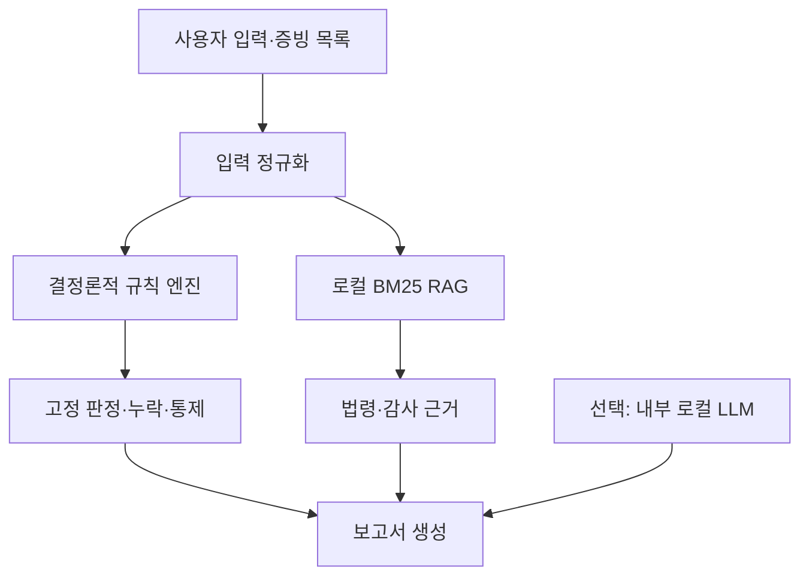

# MIL-Check 근거조사·규칙설계·인트라넷 구현 보고서

기준일: 2026-07-23  
대상: 대한민국 국가계약법이 적용되는 군 물품·용역 계약의 사전검토  
초기 범위: 소액수의, 경쟁 불성립형, 긴급·보안형

## 1. 결론

MIL-Check는 외부 인터넷이나 외부 LLM API가 없어도 작동하도록 구현할 수 있다. 법령·예규·공개
사례를 승인된 시점에 반입해 로컬 색인을 만들고, 금액·자격·증빙·절차 판단은 결정론적 규칙 엔진이
수행한다. LLM은 필수 구성요소가 아니며, 내부망에 승인된 국방 LLM 또는 온프레미스 오픈웨이트
모델이 있을 때 보고서 문장 정리 용도로만 선택적으로 붙인다.

외부 상용 API에 군 계약 입력을 보내는 구조는 기본안에서 제외했다. 공개 데이터만 처리하는
대회 시연 환경에서는 별도 클라우드 프로토타입을 만들 수 있지만, 실제 군 내부 배포와 동일한
보안성을 주장해서는 안 된다.

## 2. 범위와 제품 정의

사용자 입력은 다음 네 묶음이다.

- 물품·용역: 품명, 규격, 수량, 사용 목적
- 금액: 부가가치세를 제외한 실제 추정가격, 가격 산출 근거
- 제안 근거: 소액·호환성/특허/유일공급·긴급/보안 중 하나와 세부사유
- 증빙: 시장조사, 견적, 특허·공급·호환성 자료, 긴급 발생기록, 보안 위험분석 등

출력은 허가/불허 자동결정이 아니라 다음을 포함한 사전검토 보고서다.

- 제안 법적 근거와 2026년 현행 조문
- 금액·상대자·견적 절차의 기계적 점검
- 사유별 필수 증빙 누락
- 공개 감사·해석 사례에서 파생한 위험 신호
- 계약담당공무원이 확인할 후속 통제

이 정의는 공개 데이터만으로 학습된 “적법성 판정 AI”라는 과장된 주장을 피하면서도 실제 행정
시간을 줄이고 검토 품질을 표준화한다.

## 3. 현행 법령·예규 수집 결과

### 3.1 최우선 규정

| 우선순위 | 규정 | 확인한 현행본 | MIL-Check 사용 |
|---|---|---|---|
| 1 | [국가계약법](https://www.law.go.kr/lsInfoP.do?ancYnChk=0&lsId=000695) | 2026-06-11 시행, 법률 제21418호 | 일반경쟁 원칙, 계약서 등 상위 원칙 |
| 2 | [국가계약법 시행령](https://www.law.go.kr/lsInfoP.do?ancYnChk=0&lsId=002652) | 2026-06-03 시행, 대통령령 제36338호 | 제26조 수의사유, 제30조 견적 절차 |
| 3 | [국가계약법 시행규칙](https://www.law.go.kr/lsInfoP.do?ancYnChk=0&lsId=006590) | 2026-01-02 시행, 재정경제부령 제1호 | 제33조 전자견적 예외 |
| 4 | [정부 입찰·계약 집행기준](https://www.law.go.kr/LSW/admRulInfoP.do?admRulSeq=2100000276688&chrClsCd=010201) | 2026-04-30 시행, 계약예규 제148호 | 제4장 긴급·소액수의 집행, 상대자 결정·배제 |
| 5 | [국방부 계약업무처리훈령](https://www.law.go.kr/LSW/admRulInfoP.do?admRulSeq=2100000253324&chrClsCd=010201) | 2024-10-24 시행, 국방부훈령 제2981호 | 국방 계약업무 정의·절차·D2B 연계 |
| 6 | [국군재정관리단 계약 관련 업무처리절차 훈령](https://www.law.go.kr/LSW/admRulInfoP.do?admRulSeq=2100000248478&chrClsCd=010201) | 2024-10-23 시행, 국방부훈령 제2980호 | 계약요청·가격자료·첨부문서 구조 |

국방부 훈령 두 건은 국가법령정보센터의 2026-07-23 현행 목록에서 확인했지만, 시행일 자체는
2024년이다. 실제 배포 직전 국방 내부의 최신 지침·개정예고·각 군 규정을 계약담당부서가 추가
확인해야 한다.

### 3.2 현행성에서 발견한 중요 변경점

- 국가계약법은 2026-06-11 시행본, 시행령은 2026-06-03 시행본이다.
- 시행령 제26조제1항제5호가목의 국가 물품·용역 일반 소액수의 기준은 추정가격 2천만원 이하다.
- 2천만원 초과 1억원 이하 물품·용역은 아무 업체와 가능한 것이 아니라 소기업·소상공인,
  특수지식 계약, 여성·장애인기업 등 열거 요건을 확인해야 한다.
- 시행령 제30조에 따라 수의계약은 2인 이상 견적이 원칙이고, 1인 견적 사유와 전자견적 의무는
  별도 판단해야 한다.
- 과거 감사·법령해석의 금액이나 조문 번호는 현행 규칙으로 다시 계산해야 한다.

## 4. 공개 감사·법령해석 사례 수집 결과

구조화한 사례 목록 전체는 `data/legal_sources.json`, 검색용 요약은 `data/corpus.jsonl`에 있다.

| 사례 | 기관·일자 | 추출한 평가 원칙 | 직접 법적 선례로 사용? |
|---|---|---|---|
| [공개수의계약 질의](https://www.law.go.kr/LSW/cgmExpcInfoP.do?cgmExpcDatSeq=2292753&mode=2&ofiClsCd=350129) | 방위사업청, 2025-12-23 | 공개수의도 전자견적·상대자 결정 절차 필요 | 당시 인용 예규를 현행본과 재대조 |
| [방산물자 지정범위·정비](https://www.law.go.kr/LSW/cgmExpcInfoP.do?cgmExpcDatSeq=373524&mode=2&ofiClsCd=350129) | 방위사업청, 2007-07-19 | 열거 조항의 대상행위를 임의로 확장하지 않음 | 역사적 위험패턴만 사용 |
| [맞춤형복지 관리대행](https://www.law.go.kr/LSW/cgmExpcInfoP.do?cgmExpcDatSeq=387444&mode=2&ofiClsCd=350112) | 국방부, 2015-08-24 | 특별법 법인·기존 협정만으로 수의사유 자동 성립 안 함 | 경과조치 만료, 원칙만 사용 |
| [수의계약 실태 특정감사](https://www.kma.go.kr/kma/servlet/NeoboardProcess?bid=ngamsa02&callback=https%3A%2F%2Fwww.kma.go.kr%2Fkma%2Fpublic%2Fintegrity_02.jsp&fno=1&k=ATC201907151839121_9d7881b4-d96a-4606-af1a-a1d63260f866.pdf&mode=download&num=59&ses=USERSESSION) | 기상청, 2019 | 업체편중·연도말·분할·가격근거를 함께 점검 | 국가계약 위험패턴 |
| [그늘막 분할 면책](https://www.bai.go.kr/proactive/adm/bbs/detailBoardArticle.do?bbsId=BBSMSTR_100000000065&mdex=proactive023&nttId=128185) | 감사원, 2022-01-20 | 분할 정황과 수요 변동에 따른 불가피성을 구분 | 지방계약이므로 패턴만 사용 |
| [2025 수의계약 운영실태](https://www.guro.go.kr/www/downloadBbsFile.do?atchmnflNo=334943&bbsNo=593&key=1817&nttNo=217786&pageIndex=1&pageUnit=10) | 구로구, 2025 | 행정편의·선례답습 분할발주 위험 | 지방계약 패턴 |
| [특정제품 규격 지정 감사](https://www.busan.go.kr/comm/getFile?fileNo=1&fileTy=ATTACH&srvcId=BBSTY1&upperNo=1307041) | 부산광역시, 2017 | 특정 인증번호로 경쟁을 인위적으로 배제하는 위험 | 지방계약 패턴 |
| [인쇄계약 편중 감사](https://mods.go.kr/boardDownload.es?bid=11829&list_no=431872&seq=2) | 통계청, 2024 | 개별 금액뿐 아니라 반복 업체편중을 탐지 | 국가계약 위험패턴 |

## 5. 수의계약 3유형 규칙표

### 5.1 소액수의 — 물품·용역 MVP

| 조건 | 기계 규칙 | 필요한 증빙 | 실패·경고 |
|---|---|---|---|
| 일반 물품·용역 | 추정가격 ≤ 2천만원 | 가격산출, 자격, 이해충돌, 분할검토 | 2천만원 초과 일반업체면 제안사유 기각 |
| 소기업·소상공인 | 2천만원 초과 1억원 이하 가능 | 유효한 기업확인, 전자견적 계획 | 자격 미확인 또는 1인 비전자견적이면 보완 |
| 특수지식·기술·자격 | 2천만원 초과 1억원 이하 | 특수성·자격 필요성 | 일반 용역을 특수용역으로 포장하면 기각 검토 |
| 여성·장애인·일정 사회적경제기업 | 1억원 이하 | 유효한 확인서와 법정 요건 | 5천만원 초과는 1인 견적 예외가 아님 |
| 청년창업기업 | 5천만원 이하 | 유효한 청년창업기업 요건 | 상한 초과 시 기각 |
| 견적 | 2인 이상 원칙; 열거 사유만 1인 | 견적서 또는 전자견적 계획 | 절차 누락 시 보완 |
| 분할 | 동일 사업 인위적 분할 금지 | 동일·유사 구매 합산표, 불가피성 기록 | 한도 맞춤 분할 정황은 기각 |

### 5.2 경쟁 불성립형 — 시행령 제26조제1항제2호

| 세부근거 | 성립조건 | 최소 증빙 | 감사 위험 |
|---|---|---|---|
| 원공급자 직접 설치·정비 | 제조·공급자가 직접해야 목적 달성 | 원공급자 증명, 직접수행 필요성, 시장조사 | 단순 보증편의 |
| 기존 물품 호환성 | 타사 사용 시 실제 호환성 상실 | 설치자산 규격, 시험·기술자료, 대체품 조사 | 업체 확인서만 첨부 |
| 특허·등록 물품 | 권리 유효 + 적절한 대용품·대체품 없음 | 등록증, 유효성, 시장조사, 대체불가 분석 | 특허 존재만으로 자동 수의 |
| 생산자·소지자 1인 | 공급자 1인 + 다른 물품으로 목적달성 불가 | 복수 채널 시장조사, 객관적 요구조건 | 발주자가 특정규격으로 1인 상황 조성 |
| 특정 기술용역 | 특정 기술·품질·경험·자격이 본질적으로 필요 | 유일 자격, 범위 필요성, 대체 전문가 조사 | 명성·기존 거래만 근거 |

이 유형은 시행령 제26조제5항의 보고 및 감사원 통지 절차까지 체크리스트에 포함했다. 1인 견적이
허용될 수 있어도 가격 적정성 검토를 생략하지 않는다.

### 5.3 긴급·보안형 — 시행령 제26조제1항제1호가목·나목

| 세부근거 | 성립조건 | 최소 증빙 | 기각·보완 신호 |
|---|---|---|---|
| 긴급 | 예측 곤란한 사건, 즉시 기한, 경쟁기간 확보 불가 | 사건일지, 피해·작전 기한, 경쟁불가 시간표, 최소범위 | 연말 예산소진, 자체 행정지연 |
| 보안 | 공개경쟁이 국가안보·방위계획·정보·군시설 보안을 해침 | 보안근거, 공개 시 위험분석, 최소범위, 업체 보안조치 | “군용”이라는 표지만 존재 |

금액 상한이 없다는 사실은 무제한 계약을 뜻하지 않는다. 긴급·보안에 필요한 최소 범위, 가격
적정성, 업체 자격과 이해충돌, 계약·검수 증빙은 그대로 남는다.

## 6. 평가세트

`eval/cases.jsonl`은 총 24건이다.

- 가상 사례 18건: 세 유형의 통과·보완·기각 경계값과 범위 외 사례
- 공개 사례 기반 재구성 6건: 분할의 불가피성, 반복 편중, 특정규격, 특별법 법인 등
- 정답 라벨: `PASS_WITH_CONTROLS`, `NEEDS_EVIDENCE`, `REJECT_GROUND`, `OUT_OF_SCOPE`

공개 사례는 기관·업체를 재현하는 학습 데이터가 아니라 논점을 비식별 가상 입력으로 바꾼 것이다.
원 사례의 당시 처분을 그대로 정답으로 사용하지 않고 2026년 규칙으로 다시 라벨링했다.

초기 평가지표는 규칙 회귀 정확도다. 다음 단계에서는 계약실무자 2인 이상이 독립 라벨링하여
일치도, 누락 증빙 재현율, 잘못된 통과(false pass) 비율을 측정해야 한다. 최우선 지표는 정확도
평균이 아니라 `REJECT_GROUND` 사례를 통과시키지 않는 안전성이다.

## 7. 구현 구조

- 규칙 엔진: 금액 상한, 상대자 요건, 견적 수, 대체품 존재, 자체 긴급성 등
- RAG: 인터넷 없이 `data/corpus.jsonl`에서 BM25로 관련 근거 검색
- LLM: 기본 비활성화. 활성화해도 규칙 엔진의 판정과 근거를 바꾸지 못하고 문장 요약만 수행
- 보고서: 판정, 조문, 누락 증빙, 필수 통제, 검색 근거, 면책문구

## 8. 인트라넷과 LLM 우려에 대한 판단

### 8.1 외부 API 사용 가능 여부

군 내부 자료를 외부 상용 API로 보내도 되는지는 개발자가 판단할 문제가 아니다. 해당 체계의
보안등급, 데이터 분류, 망연계 정책, 클라우드 이용승인, 개인정보·군사기밀 포함 여부에 대해
보안담당기관의 명시적 승인이 있어야 한다. 승인 전에는 사용 불가로 가정하는 것이 안전하다.

특히 계약명·수량·납기·부대 위치·장비 고장·재고 부족·작전 일정은 각각 공개등급처럼 보여도
결합될 때 민감한 운영정보가 될 수 있다. 익명화만으로 외부 전송이 자동 허용되는 것도 아니다.

### 8.2 권장 배포안

| 안 | 인터넷 | LLM | 장점 | 판단 |
|---|---|---|---|---|
| A. 규칙+로컬 RAG | 불필요 | 없음 | 가장 단순, 설명가능, 보안심사 용이 | 대회 MVP 기본안 |
| B. 규칙+로컬 RAG+온프레미스 LLM | 불필요 | 내부 서버 | 자연어 증빙요약·보고서 품질 향상 | 승인된 모델·GPU가 있을 때 |
| C. 외부 API | 필요 | 상용 클라우드 | 개발 편의 | 군 내부 배포 기본안에서 제외 |

따라서 “LLM을 못 쓰면 프로젝트가 무너지는가?”에 대한 답은 아니다. 핵심 가치는 규칙·근거검색·
증빙 누락 탐지에 있으며 현재 프로토타입은 A안으로 완전 작동한다. 대회 시연에서 생성형 AI를
명확히 보여주고 싶다면 공개·가상 데이터만 사용하는 B안의 로컬 모델 또는 별도의 공개망 시연
모드를 사용할 수 있다. 다만 실제 배포구조와 시연구조의 차이를 명시해야 한다.

### 8.3 데이터 반입·업데이트

1. 공개망 수집 구역에서 공식 원문과 해시·시행일·출처 메타데이터 생성
2. 악성코드 검사와 보안성 검토
3. 승인된 매체·망연계 절차로 내부망 반입
4. 내부 색인 재생성
5. 24건 이상 회귀평가와 변경 조문 영향분석
6. 계약담당부서 승인 후 버전 배포

실시간 인터넷 연결 대신 “승인된 규정 스냅샷의 주기적 반입”이 군 환경에 더 잘 맞는다.

## 9. 현재 한계와 다음 우선순위

현재 구현은 실제 작동하는 MVP지만 대회 제출용 완성체는 아니다.

1. 국방부·각 군 내부 비공개 지침과 실제 결재서식은 포함하지 않았다.
2. 재공고 유찰, 방산물자 특례, 보훈·복지단체, 공사·임대차는 범위 밖이다.
3. 3만 건 공개 계약 데이터가 작업공간에 제공되지 않아 유사계약 검색은 아직 법령·사례 corpus만 사용한다.
4. 공개 사례 정답은 법률 전문가 확정 라벨이 아니다.
5. OCR 문서·첨부 증빙의 진위와 유효기간 자동검증은 후속 기능이다.

다음 작업은 실제 공개 계약 3만 건을 `contract_id, item, category, amount, supplier, method,
legal_ground, contract_date, source_url`로 정규화해 유사사례 검색층에 추가하는 것이다. 그다음
계약실무자 검토를 받아 24건 평가세트를 100건 이상으로 확장하고, 잘못된 통과를 우선 줄여야 한다.
